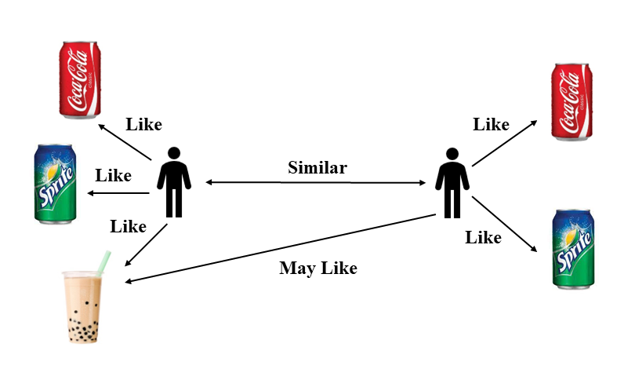
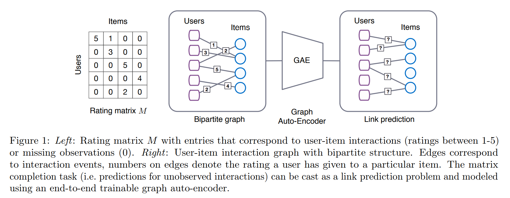

# Github_Recommendation
## Introduction
This project is supported by the open source summer activity and the towhee community. It aims to design an efficient recommendation algorithm to recommend favorite projects for users.


## Development Progress
* Data Collection
* Baseline algorithm design
* DL algorithm design
* **Analysis and comparison**

## Configuration
* Setup a virtual environment with python 3.8 or newer
* Install requirements
```
pip install -r Resource/requirements1.txt
pip install -r Resource/requirements2.txt
```


## Data Collection
Web resource parsing and collaborative crawler technology will be used to collect data. The whole process is divided into three parts:
* **UserInfo Collection**: We collect user information(`username` and `homepage`) from the following list of the top 30 most popular projects on the GitHub platform.
* **UserStar Collection**: Analyze the number of repos owned by the user and the number of projects starred by the user through the user's homepage.
* **UserProject Collection**: 
   - Call GitHub's public API interface according to the username to obtain the project records:
    ```https://api.github.com/users/username/starred ```
   - Use `aiohttp` to speed up the process.
   - Exploit `token list` and `random function` to break the number of interface accesses.

## Data Description
* The data field contains five fields, namely, the user name, the project name (full name), the number of stars and forks of the project, and whether the user has starred the project.The data is organized into CSV files as follows.

| user | project | star | fork | has_star |
| ---- | ---- | ---- |---- |---- |

* Based on different requirements, we provide two sizes of data folder for users to process:`tiny`,`small`,`large`.Each data folder includes three types of csv files:
    - `users`: User information table, include the mapping relationship between index and username
    - `projects`:Project information table, use three fileds('name', 'star', 'fork') to depict projects
    - `data`:Correlation information between user and project. In this project, we use the field 'has_star' to manifest the relationship. In the tiny dataset, it includes 2105 users, 4761 projects, 311305 records totally. In the small dataset, it includes 3000 users, 182404 projects, 929489 records totally.In the large dataset, it includes 70129 users, 271530 projects, 21775242 records totally.

## Baseline Algorithm
* **User-based Collaborative Filtering**
 1. We build a `similarity matrix` of users according to the projects starred by users.
 2. For each target user, we find top N `similiar users` to him/her. 
 3. Recommend top K projects starred by these similiar users.
 4. For each recommened project, the target user has never seen ever before.



## DL Algorithm Design
* **GC-MC(Graph Convolution Matrix Completion, Berg et al. KDD 2018)**
1. We consider the recommendation task as a `link prediction` problem.
2. Since the original dataset has only connected positive edges, we use the `negative sampling` technique to sample the negative edges with the same number of connected positive edges.
3. Thus, this problem degenerates into a `binary classification` problem.
4. After training, the trained model was used to calculate the probablity of each project starred by the target user.
5. Select top K projects with high probability.
6. For each recommened project, the target user has never seen ever before.



## Train and Test
```
cd Test
python test_Github_UbCF.py
or
python test_Github_GCMC.py
```
